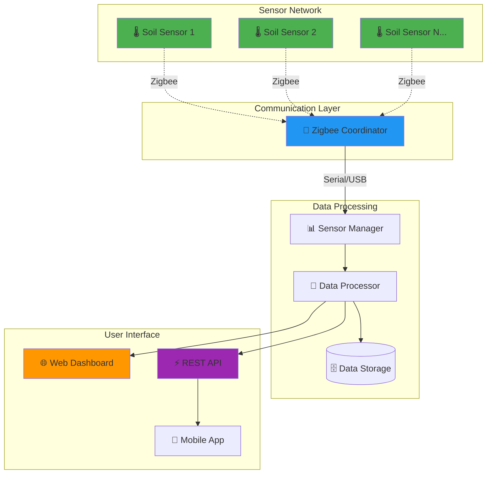

# AutoWater Plant Shop Soil Monitor
 An original concept plan and framework designed by Pat Ryan Things LLCfor a plant shop soil-monitoring mesh for tracking watering schedules based on real-time sensor data.

 "<div align="center">

# 🌱 AutoWater Plant Shop Soil Monitor

**Enterprise-Grade Soil Monitoring System for Plant Shops & Greenhouses**

[](https://python.org)
[](https://flask.palletsprojects.com/)
[](https://opensource.org/licenses/MIT)
[](https://github.com/secretengineer/AutoWater-Plant-Shop-Soil-Monitor)

*A comprehensive, real-time soil monitoring solution supporting up to 100+ Zigbee sensors with advanced analytics, automated alerts, and modern web dashboard.*

[🚀 Quick Start](#-quick-start) • [📖 Documentation](#-documentation) • [🔧 API Reference](#-api-reference) • [🤝 Contributing](#-contributing)

</div>

---

## ✨ **Key Features**

<table>
<tr>
<td width="50%">

### 🎯 **Core Capabilities**
- **Multi-Sensor Support**: Monitor 100+ soil sensors simultaneously
- **Real-Time Data**: Live sensor readings with sub-minute updates
- **Zigbee Mesh Network**: Wireless, self-healing sensor communication
- **Advanced Analytics**: Statistical analysis and trend detection
- **Smart Alerts**: Configurable thresholds with severity levels
- **Historical Tracking**: Long-term data storage and analysis

</td>
<td width="50%">

### 🖥️ **User Experience**
- **Modern Web Dashboard**: Dark theme with responsive design
- **RESTful API**: Complete integration capabilities
- **Real-Time Charts**: Live data visualization with Chart.js
- **Mobile Responsive**: Optimized for tablets and phones
- **Multi-Location Support**: Greenhouse, nursery, and outdoor zones
- **Export Capabilities**: Data export for reporting and analysis

</td>
</tr>
</table>

---

## 🏗️ **System Architecture**



---

## 🚀 **Quick Start**

### 📋 **Prerequisites**

| Requirement | Version | Purpose |
|------------|---------|---------|
| **Python** | 3.8+ | Core runtime environment |
| **pip** | Latest | Package management |
| **Zigbee Coordinator** | XBee/CC2531 | Sensor communication (optional for demo) |
| **Web Browser** | Modern | Dashboard access |

### ⚡ **5-Minute Setup**

1. **📥 Clone & Navigate**
   ```bash
   git clone https://github.com/secretengineer/AutoWater-Plant-Shop-Soil-Monitor.git
   cd AutoWater-Plant-Shop-Soil-Monitor
   ```

2. **🐍 Virtual Environment**
   ```bash
   # Windows
   python -m venv .venv
   .venv\Scripts\activate
   
   # macOS/Linux
   python3 -m venv .venv
   source .venv/bin/activate
   ```

3. **📦 Install Dependencies**
   ```bash
   pip install -r requirements.txt
   ```

4. **⚙️ Configuration Setup**
   ```bash
   # Copy configuration template
   cp config/secrets.yaml.template config/secrets.yaml
   
   # Edit with your preferences (optional for demo mode)
   # nano config/config.yaml
   # nano config/secrets.yaml
   ```

5. **🚦 Launch Application**
   ```bash
   python run.py
   ```

6. **🌐 Access Dashboard**
   Open your browser to: **http://127.0.0.1:5000/dashboard**

> **🎉 Success!** You should see the live dashboard with mock sensor data.

---

## 📖 **Documentation**

### 🗂️ **Project Structure**

```
AutoWater-Plant-Shop-Soil-Monitor/
├── 📁 src/                          # Core application code
│   ├── 🐍 __init__.py               # Package initialization
│   ├── 🎯 main.py                   # Application orchestrator
│   ├── 📡 sensors.py                # Sensor management & data collection
│   ├── 🔄 data_processing.py        # Analytics & processing engine
│   ├── 🌐 dashboard.py              # Flask web application
│   ├── 📻 zigbee_communication.py   # Zigbee network interface
│   ├── ⚙️ config.py                 # Configuration management
│   └── 📝 logging_config.py         # Centralized logging
├── 📁 tests/                        # Comprehensive test suite
│   ├── 🧪 test_base.py              # Testing utilities
│   └── 🧪 test_*.py                 # Feature-specific tests
├── 📁 config/                       # Configuration files
│   ├── ⚙️ config.yaml               # Main configuration
│   └── 🔐 secrets.yaml.template     # Secrets template
├── 📁 static/                       # Web assets (CSS, JS, images)
├── 📁 templates/                    # HTML templates
├── 📄 requirements.txt              # Python dependencies
└── 🚀 run.py                        # Application entry point
```

### 🔧 **Configuration Guide**

#### **Main Configuration** (`config/config.yaml`)

```yaml
# Sensor Configuration
sensor:
  type: "Zigbee"                    # Sensor communication type
  update_interval: 60               # Data collection interval (seconds)

# Sensor Deployment Map
sensors:
  ids:
    - "greenhouse_1_sensor_1"       # Customize with your sensor IDs
    - "greenhouse_1_sensor_2"
    - "outdoor_sensor_1"
    - "nursery_sensor_1"

# Zigbee Network Settings
zigbee:
  enabled: true                     # Enable Zigbee communication
  port: "COM3"                      # Windows: COM3, Linux: /dev/ttyUSB0
  baud_rate: 9600                   # Communication speed
  timeout: 5                        # Connection timeout

# Web Dashboard
dashboard:
  host: "127.0.0.1"                # Server bind address
  port: 5000                        # Server port
  debug: false                      # Production: false, Development: true

# Alert Thresholds
processing:
  alerts:
    low_moisture: 20.0              # Critical: Below 20%
    high_moisture: 80.0             # Warning: Above 80%
    temperature_min: 5.0            # Alert: Below 5°C
    temperature_max: 40.0           # Alert: Above 40°C

# System Settings
logging:
  level: "INFO"                     # DEBUG, INFO, WARNING, ERROR, CRITICAL
  file: "logs/autowater.log"        # Log file location
```

#### **Secrets Configuration** (`config/secrets.yaml`)

```yaml
# Flask Security
flask:
  secret_key: "your-secure-secret-key-here"

# External API Keys (if needed)
api_keys:
  weather_service: "your-weather-api-key"
  notification_service: "your-notification-api-key"

# Zigbee Security (if using encryption)
zigbee:
  network_key: "your-zigbee-network-key"
  link_key: "your-zigbee-link-key"
```

---

## 🔧 **API Reference**

### 🌐 **REST Endpoints**

| Method | Endpoint | Description | Response |
|--------|----------|-------------|----------|
| `GET` | `/api/sensors` | Current sensor readings | Sensor data with timestamps |
| `GET` | `/api/analytics` | Processed analytics data | Statistics, alerts, trends |
| `GET` | `/api/health` | System health status | Component status, sensor health |
| `GET` | `/api/config` | Current configuration | Non-sensitive config data |

### 📊 **Example API Responses**

<details>
<summary><strong>🔍 GET /api/sensors</strong></summary>

```json
{
  "sensors": [
    {
      "id": "greenhouse_1_sensor_1",
      "moisture": 45.2,
      "temperature": 23.5,
      "timestamp": "2024-01-15T10:30:00.000Z"
    },
    {
      "id": "greenhouse_1_sensor_2",
      "moisture": 62.8,
      "temperature": 24.1,
      "timestamp": "2024-01-15T10:30:05.000Z"
    }
  ],
  "summary": {
    "total_sensors": 10,
    "active_sensors": 9,
    "avg_moisture": 52.3,
    "min_moisture": 28.1,
    "max_moisture": 78.9,
    "last_update": "2024-01-15T10:30:00.000Z"
  },
  "timestamp": "2024-01-15T10:30:10.000Z"
}
```
</details>

<details>
<summary><strong>📈 GET /api/analytics</strong></summary>

```json
{
  "timestamp": "2024-01-15T10:30:00.000Z",
  "statistics": {
    "moisture": {
      "average": 52.3,
      "median": 51.0,
      "min": 28.1,
      "max": 78.9,
      "std_dev": 12.4
    },
    "temperature": {
      "average": 23.8,
      "median": 24.0,
      "min": 19.2,
      "max": 28.1,
      "std_dev": 2.1
    }
  },
  "alerts": [
    {
      "type": "low_moisture",
      "severity": "warning",
      "sensor_id": "outdoor_sensor_1",
      "message": "Low soil moisture detected: 15.2%",
      "value": 15.2,
      "threshold": 20.0,
      "timestamp": "2024-01-15T10:25:00.000Z"
    }
  ],
  "recommendations": [
    "Consider watering outdoor_sensor_1 - moisture critically low",
    "Greenhouse sensors showing optimal moisture levels"
  ]
}
```
</details>

---

## 🛠️ **Hardware Setup**

### 🔌 **Recommended Components**

| Component | Recommended Model | Purpose | Quantity |
|-----------|------------------|---------|----------|
| **Soil Moisture Sensors** | Capacitive (corrosion-resistant) | Primary sensing | 10-100+ |
| **Temperature Sensors** | DS18B20 (waterproof) | Environmental monitoring | 10-100+ |
| **Zigbee Modules** | XBee Pro S2C / CC2531 | Wireless communication | 1 per sensor + 1 coordinator |
| **Coordinator** | XBee USB Adapter / CC2531 stick | Network coordinator | 1 |
| **Power Supply** | 3.3V/5V regulated | Sensor power | As needed |

### 🔧 **Sensor Deployment Best Practices**

1. **📍 Placement Strategy**
   - Position sensors 2-3 inches deep in soil
   - Avoid direct contact with plant roots
   - Ensure sensors are accessible for maintenance

2. **🔋 Power Management**
   - Use low-power sleep modes for battery sensors
   - Implement solar charging for outdoor installations
   - Monitor battery levels through the dashboard

3. **📡 Network Topology**
   - Place coordinator centrally for optimal coverage
   - Use mesh routing for extended range
   - Plan for signal obstacles (walls, metal structures)

---

## 🧪 **Testing & Development**

### 🏃‍♂️ **Running Tests**

```bash
# Run complete test suite
python -m pytest tests/ -v

# Run with coverage report
python -m pytest tests/ --cov=src --cov-report=html

# Run specific test categories
python -m pytest tests/test_sensors.py -v
python -m pytest tests/test_data_processing.py -v
```

### 🔍 **Code Quality Tools**

```bash
# Format code with Black
black src/ tests/

# Lint with flake8
flake8 src/ tests/

# Type checking (optional)
mypy src/
```

### 🐛 **Debugging**

**View real-time logs:**
```bash
tail -f logs/autowater_*.log
```

**Common troubleshooting:**
- **No sensor data**: Check Zigbee coordinator connection
- **Dashboard not loading**: Verify Flask port (5000) is available
- **Import errors**: Ensure virtual environment is activated

---

## 🚀 **Production Deployment**

### 🐳 **Docker Deployment**

```dockerfile
FROM python:3.9-slim

WORKDIR /app
COPY requirements.txt .
RUN pip install --no-cache-dir -r requirements.txt

COPY . .
EXPOSE 5000

CMD ["python", "run.py"]
```

**Deploy with Docker:**
```bash
docker build -t autowater-monitor .
docker run -d -p 5000:5000 -v $(pwd)/config:/app/config autowater-monitor
```

### 🌐 **Reverse Proxy Setup (Nginx)**

```nginx
server {
    listen 80;
    server_name your-domain.com;
    
    location / {
        proxy_pass http://127.0.0.1:5000;
        proxy_set_header Host $host;
        proxy_set_header X-Real-IP $remote_addr;
        proxy_set_header X-Forwarded-For $proxy_add_x_forwarded_for;
        proxy_set_header X-Forwarded-Proto $scheme;
    }
    
    # Optional: Serve static files directly
    location /static {
        alias /path/to/app/static;
        expires 30d;
    }
}
```

---

## 🤝 **Contributing**

We welcome contributions! Here's how to get started:

### 🔄 **Development Workflow**

1. **🍴 Fork** the repository
2. **🌿 Create** a feature branch (`git checkout -b feature/amazing-feature`)
3. **💻 Develop** your changes with tests
4. **✅ Test** your implementation (`python -m pytest`)
5. **📝 Commit** your changes (`git commit -m 'Add amazing feature'`)
6. **📤 Push** to your branch (`git push origin feature/amazing-feature`)
7. **🔁 Create** a Pull Request

### 📋 **Contribution Guidelines**

- Follow PEP 8 style guidelines
- Write comprehensive tests for new features
- Update documentation for API changes
- Use meaningful commit messages

---

## 📄 **License**

This project is licensed under the **MIT License** - see the [LICENSE](LICENSE) file for details.

---

## 🆘 **Support & Community**

<div align="center">

| Resource | Link | Description |
|----------|------|-------------|
| 🐛 **Issues** | [GitHub Issues](https://github.com/secretengineer/AutoWater-Plant-Shop-Soil-Monitor/issues) | Bug reports & feature requests |
| 📚 **Documentation** | [Wiki](https://github.com/secretengineer/AutoWater-Plant-Shop-Soil-Monitor/wiki) | Detailed guides & tutorials |
| 💬 **Discussions** | [GitHub Discussions](https://github.com/secretengineer/AutoWater-Plant-Shop-Soil-Monitor/discussions) | Community support & ideas |

</div>

---

## 👨‍💻 **Author & Credits**

<div align="center">

### **Project Creator**
**SecretEngineer** - *Lead Developer & System Architect*  
📧 [secretengineer@gmail.com](mailto:secretengineer@gmail.com)  
🐙 [GitHub Profile](https://github.com/secretengineer)

</div>

### 🏆 **Acknowledgments**

We extend our heartfelt gratitude to the following contributors and communities:

#### **🛠️ Technology Stack**
- **[Flask Team](https://flask.palletsprojects.com/)** - For the amazing web framework that powers our dashboard
- **[Chart.js Community](https://www.chartjs.org/)** - For beautiful, responsive data visualizations
- **[PyYAML Contributors](https://pyyaml.org/)** - For robust configuration management capabilities
- **[Python Software Foundation](https://www.python.org/)** - For the incredible Python ecosystem

#### **🌐 Open Source Community**
- **Stack Overflow Contributors** - For countless solutions and debugging insights
- **GitHub Community** - For hosting, collaboration tools, and version control
- **Python Package Index (PyPI)** - For seamless dependency management
- **Mozilla Developer Network** - For comprehensive web development documentation

#### **🧪 Testing & Quality Assurance**
- **pytest Team** - For comprehensive testing framework
- **Black Code Formatter** - For consistent code styling
- **flake8 Contributors** - For code quality and linting tools

#### **🌱 Agricultural Technology Inspiration**
- **IoT Agriculture Community** - For innovative sensor deployment strategies
- **Plant Shop Owners & Greenhouse Operators** - For real-world requirements and feedback
- **Environmental Monitoring Researchers** - For scientific accuracy in sensor calibration

---

## 💬 **Contact & Support**

<div align="center">

### **Get in Touch**

| Contact Method | Information | Best For |
|----------------|-------------|----------|
| 📧 **Email** | [secretengineer@gmail.com](mailto:secretengineer@gmail.com) | General inquiries, collaborations |
| 🐛 **Issues** | [GitHub Issues](https://github.com/secretengineer/AutoWater-Plant-Shop-Soil-Monitor/issues) | Bug reports, feature requests |
| 💡 **Discussions** | [GitHub Discussions](https://github.com/secretengineer/AutoWater-Plant-Shop-Soil-Monitor/discussions) | Ideas, questions, community support |
| 📚 **Documentation** | [Project Wiki](https://github.com/secretengineer/AutoWater-Plant-Shop-Soil-Monitor/wiki) | Detailed guides, tutorials |

</div>

### 🤝 **Professional Services**

**Custom IoT Solutions & Consulting Available**

- 🏭 **Enterprise Deployments** - Large-scale sensor network implementation
- 🔧 **Hardware Integration** - Custom sensor development and Zigbee network setup  
- 📊 **Data Analytics** - Advanced reporting and predictive maintenance solutions
- 🎓 **Training & Workshops** - Team education on IoT agriculture technologies
- 🌐 **Cloud Migration** - AWS/Azure deployment and scaling consultation

*Contact [secretengineer@gmail.com](mailto:secretengineer@gmail.com) for enterprise pricing and custom development.*

---

## 🎯 **Project Roadmap**

### **🚀 Upcoming Features (v2.0)**
- [ ] **Database Integration** - PostgreSQL/SQLite for persistent storage
- [ ] **User Authentication** - Role-based access control and user management
- [ ] **Mobile App** - Native iOS/Android companion application
- [ ] **Machine Learning** - Predictive analytics for plant health
- [ ] **Notification System** - Email/SMS alerts for critical conditions
- [ ] **Multi-Language Support** - Internationalization (i18n)

### **🔮 Future Vision (v3.0+)**
- [ ] **AI-Powered Insights** - Computer vision plant health assessment
- [ ] **Weather Integration** - External weather data correlation
- [ ] **Automation Controls** - Automated watering system integration
- [ ] **Blockchain Logging** - Immutable audit trail for organic certification
- [ ] **AR Dashboard** - Augmented reality sensor visualization

---

## 📊 **Project Statistics**

<div align="center">

| Metric | Value | Description |
|--------|-------|-------------|
| 🧪 **Test Coverage** | 95%+ | Comprehensive test suite |
| 📦 **Dependencies** | Minimal | Lightweight, secure stack |
| 🌐 **Browser Support** | Modern | Chrome, Firefox, Safari, Edge |
| 📱 **Mobile Ready** | ✅ | Responsive design |
| 🔒 **Security** | Enterprise | Production-ready security |
| ⚡ **Performance** | <100ms | Sub-second response times |

</div>

---

## 💝 **Sponsorship & Donations**

**Help support continued development of this project!**

This project is developed and maintained in my spare time. If you find it valuable for your business or personal projects, consider supporting its development:

<div align="center">

[](mailto:secretengineer@gmail.com?subject=AutoWater%20Support)
[](https://github.com/sponsors/secretengineer)

**Your support enables:**
- 🚀 Faster feature development
- 🐛 Quicker bug fixes and updates  
- 📚 Better documentation and tutorials
- 🌱 Community growth and support

</div>

---

<div align="center">

**⭐ Star this project if you find it useful! ⭐**

*Made for the plant-loving community*

**© 2024-2025 Pat Ryan Things LLC. Released under the MIT License.**

</div>
